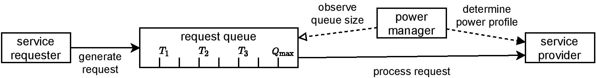

# PAYNT

PAYNT (Probabilistic progrAm sYNThesizer) is a tool for the automated synthesis of probabilistic programs. PAYNT takes a program with holes (a so-called sketch) and a PCTL specification, and outputs a concrete hole assignment that yields a satisfying program, if such an assignment exists. PAYNT also supports the synthesis of finite-state controllers for POMDPs. Internally, PAYNT interprets the incomplete probabilistic program as a family of Markov chains and uses state-of-the-art synthesis methods on top of the model checker [Storm](https://github.com/moves-rwth/storm) to identify satisfying realization. PAYNT is implemented in Python and uses [Stormpy](https://github.com/moves-rwth/stormpy), Python bindings for Storm. PAYNT is hosted on [github](https://github.com/randriu/synthesis).

PAYNT is described in 
- [1] PAYNT: A Tool for Inductive Synthesis of Probabilistic Programs by Roman Andriushchenko, Milan Ceska, Sebastian Junges, Joost-Pieter Katoen and Simon Stupinsky

Most of the algorithms are described in 
- [2] Inductive Synthesis for Probabilistic Programs Reaches New Horizons by Roman Andriushchenko, Milan Ceska, Sebastian Junges, Joost-Pieter Katoen, TACAS 2021
- [3] Counterexample-Driven Synthesis for Probabilistic Program Sketches by Milan Ceska, Christian Hensel, Sebastian Junges, Joost-Pieter Katoen, FM 2019.
- [4] Shepherding Hordes of Markov Chains by Milan Ceska, Nils Jansen, Sebastian Junges, Joost-Pieter Katoen, TACAS 2019
- [5] Inductive Synthesis of Finite-State Controllers for POMDPs by Roman Andriushchenko, Milan Ceska, Sebastian Junges, Joost-Pieter Katoen, UAI 2022.
- [6] Search and Explore: Symbiotic Policy Synthesis in POMDPs by Roman Andriushchenko, Alexander Bork, Milan Ceska, Sebastian Junges, Joost-Pieter Katoen, Filip Macak, CAV 2023.


## Installation

To download PAYNT, use

```shell
git clone https://github.com/randriu/synthesis.git synthesis
cd synthesis
```

PAYNT requires [Storm](https://github.com/moves-rwth/storm) and [Stormpy](https://github.com/moves-rwth/stormpy). If you have Stormpy installed (e.g. within a Python environment), PAYNT and its dependencies can be installed by

```shell
sudo apt install -y graphviz
source ${VIRTUAL_ENV}/bin/activate
pip3 install click z3-solver graphviz
cd payntbind
python3 setup.py develop
cd ..
python3 paynt.py --help
```

If you do not have Stormpy installed, you can run the installation script `install.sh` to install Storm, Stormpy and other required dependencies. Complete compilation might take up to an hour. The Python environment will be available in `prerequisistes/venv`:

```shell
./install.sh
source prerequisistes/venv/bin/activate
python3 paynt.py --help
```

PAYNT is also available as a docker image:

```shell
docker pull randriu/paynt
docker run --rm -it randriu/paynt
python3 paynt.py --help
```


## Running PAYNT

Upon enabling the Python environment, e.g.

```shell
source ${VIRTUAL_ENV}/bin/activate
```

PAYNT can be executed using the command in the following form:

```shell
python3 paynt.py [OPTIONS]
```
where the most important options are:
- ``--project PROJECT``: the path to the benchmark folder [required]
- ``--sketch SKETCH``: the file in the ``PROJECT`` folder containing the template description or a POMDP program [default: ``sketch.templ``]
- ``--constants STRING``: the values of constants that are undefined in the sketch and are not holes, in the form: ``c1=0,c2=1``
- ``--props PROPS``: the file in the ``PROJECT`` folder containing synthesis specification [default: ``sketch.props``]
- ``--method [onebyone|ar|cegis|hybrid|ar_multicore]``: the synthesis method  [default: ``ar``]

Options associated with the synthesis of finite-state controllers (FSCs) for a POMDP include:
- ``--pomdp-memory-size INTEGER``    implicit memory size for POMDP FSCs [default: 1]
- ``--fsc-synthesis``: enables incremental synthesis of FSCs for a POMDP using iterative exploration of k-FSCs
- ``--posterior-aware``: enables the synthesis of posterior aware FSCs

SAYNT [6] and Storm associated options (pomdp-api branch of Storm and Stormpy are needed):
- ``--storm-pomdp``: enables the use of Storm features, this flag is necessary for the other options in this section to work
- ``--iterative-storm INTEGER INTEGER INTEGER``: runs the SAYNT algorithm, the parameters represent overall timeout, paynt timeout, storm timeout respectivelly. The recommended parameters for 15 minute runtime are 900 60 10
- ``--get-storm-result INTEGER``: runs PAYNT for specified amount of seconds and then runs Storm using the computed FSC at cut-offs
- ``--storm-options [cutoff|clip2|clip4|overapp|5mil|10mil|20mil|refine]``: sets the options for Storm [default: ``cutoff``]
- ``--prune-storm``: if enabled Storm results are used to prune the family of FSCs
- ``--unfold-strategy-storm [paynt|storm|cutoff]``: sets how the memory is unfolded [default: ``storm``]
- ``--use-storm-cutoffs``: if enabled the actions from cut-offs are considered in the prioritization and unfolding
- ``--export-fsc-paynt PATH``: stores the best found FSC from PAYNT to specified file
- ``--export-fsc-storm PATH``: stores the best found FSC from Storm to specified file

Other options:
- ``--help``: shows the help message of the PAYNT and aborts
- ``--export [drn|pomdp]``: exports the model to *.drn/*.pomdp and aborts
- ``--incomplete-search``:  uses incomplete search during synthesis


Here are various PAYNT calls:
```shell
python3 paynt.py --project models/cav21/maze --props hard.props
python3 paynt.py --project models/cav21/maze --props hard.props --method hybrid
python3 paynt.py --project models/pomdp/uai/grid-avoid-4-0
python3 paynt.py --project models/pomdp/uai/grid-avoid-4-0 --pomdp-memory-size 2
python3 paynt.py --project models/pomdp/uai/grid-avoid-4-0 --pomdp-memory-size 5 --method ar_multicore
timeout 10s python3 paynt.py --project models/pomdp/uai/grid-avoid-4-0 --fsc-synthesis
python3 paynt.py --project models/pomdp/storm-integration/4x3-95 --fsc-synthesis --storm-pomdp --iterative-storm 180 60 10
python3 paynt.py --project models/pomdp/storm-integration/rocks-12 --fsc-synthesis --storm-pomdp --get-storm-result 0
```

The Python environment can be deactivated by runnning
```sh
deactivate
```


# PAYNT tutorial

For instance, here is a simple PAYNT call:

```shell
python3 paynt/paynt.py --project cav21-benchmark/grid --sketch sketch.templ --properties easy.props hybrid
```

The `--project` option specifies the path to the benchmark folder: now we will investigate the __Grid__ model discussed in [1].
PAYNT inspects the content of this folder and locates the required files for the synthesis process: the sketch and the specification list.
In the example above, the sketch file is `cav21-benchmark/grid/sketch.templ` (in this case, `--sketch` option could have been omitted), the specification file is `cav21-benchmark/grid/easy.properties` and the sketch does not have undefined constants, only holes.
Finally, the last argument specifies the selected synthesis method: `hybrid`.

## Getting started with PAYNT 

Having the tool installed, you can quickly test it by navigating to the tool folder, activating the Python environment and asking PAYNT to evaluate a simple synthesis problem:

```sh
cd /home/cav21/synthesis
source env/bin/activate
python3 paynt/paynt.py --project cav21-benchmark/dpm-demo  --properties sketch.props --method hybrid
```

The syntax of the command is described in more detail in the following chapters of this README.
For now, we can see that we ask PAYNT to look at the sketch (located in directory ``cav21-benchmark/dpm-demo``) for the dynamic power manager discussed in Section 2 in [1] and synthesize it wrt. specification in file ``cav21-benchmark/dpm-demo/sketch.props`` using the advanced hybrid approach.
The tool will print a series of log messages and, in the end, a short summary of the synthesis process, similar to the one below:

```
formula 1: R[exp]{"requests_lost"}<=1 [F "finished"]
optimal setting: formula: R[exp]{"power"}min=? [F "finished"]; direction: min; eps: 0.0

method: Hybrid, synthesis time: 12.39 s
number of holes: 7, family size: 12150
super MDP size: 1502, average MDP size: 1502, MPD checks: 2, iterations: 1
average DTMC size: 172, DTMC checks: 2708, iterations: 1354

optimal: 9100.064246
hole assignment: P1=1,P2=0,P3=0,P4=2,T1=0.0,T3=0.8,QMAX=5
```
The contents of such summary will be again discussed later.
Nonetheless, we can already notice the last line where tool reports a hole assignment that yields the optimal program.
The python environment can be deactivated by runnning

```sh
deactivate
```


## Synthesizing probabilistic programs with PAYNT


### Reading the output of PAYNT

Running PAYNT produces a sequence of log and a summary printed at the end of the synthesis process.
For instance, if we run

```sh
python3 paynt/paynt.py --project cav21-benchmark/dpm-demo hybrid
```
we obtain the following summary:

```shell
formula 1: R[exp]{"requests_lost"}<=1 [F "finished"]
optimal setting: formula: R[exp]{"power"}min=? [F "finished"]; direction: min; eps: 0.0

method: Hybrid, synthesis time: 67.62 s
number of holes: 7, family size: 12150
super MDP size: 1502, average MDP size: 956, MPD checks: 116, iterations: 59
average DTMC size: 234, DTMC checks: 14206, iterations: 7103

optimal: 9100.064246
hole assignment: P1=1,P2=2,P3=2,P4=2,T1=0.0,T3=0.8,QMAX=5
```

This summary contains information about the synthesized sketch as well as the results of the synthesis process.
The first lines repeat the synthesised specifications and, if included, the optimizing property.
Next, the synthesis was carried out using the hybrid method and it on our machine it took 68 seconds.
We can see that this particular DPM benchmark contains 7 holes (parameters) and 12K family members.
The following lines are statistics about deductive (MDP-based) or inductive (counterexample-based) analysis, including sizes of analyzed MDPs/DTMCs, number of particular model checking calls, overall iterations count etc.
Notice that only the hybrid method contains both MDP- and DTMC-related information since CEGIS never deals with MDPs, and AR works exclusively with MDPs.

Finally, the last lines show the synthesis result.
In our case, PAYNT printed a hole assignment yielding optimal solution as well as the induced optimal value.

### Sketching language

PAYNT takes as an input a sketch -- program description in `PRISM` language containing some undefined parameters (holes) with associated options from domains -- and a specification given as a list of temporal logic constraints (interpreted as a conjunction of these constrains) possibly including an optimal objective. Before explaining the sketching language, let us briefly present the key ideas of the `PRISM` language -- the full documentation of the language is available [in the PRISM manual](https://www.prismmodelchecker.org/manual/ThePRISMLanguage/Introduction).

A `PRISM` program consists of one or more reactive modules that may interact with each other using synchronisation. A module has a set of (bounded) variables that span its state space. Possible transitions between states of a module are described by a set of guarded commands of the form:

```
[action] guard -> prob_1 : update_1 + ... + prob_n : update_n; 
```

If the `guard` evaluates to true, an update of the variables is chosen according to the probability distribution given by expressions `p_1` through `p_n`. The `actions` are used to force two or more modules to make the command simultaneously (i.e. to synchronise).

Recall that the sketch is a `PRISM` program with holes and allows us to compactly describe a set of candidates program.
The holes can appear in guards and updates. Replacing each hole with one of its options yields a complete program with the semantics given by a finite-state Markov chain. 

We exemplify the usage of PAYNT by the following synthesis problem.



Consider a server for request processing depicted in Figure above.
Requests are generated (externally) in random intervals and upon arrival stored in a request queue of capacity Q<sub>max</sub>. 
When the queue is full, the request is lost.
The server has three profiles -- *sleeping*, *idle* and *active* -- that differ in their power consumption.
The requests are processed by the server only when it is in the active state.
Switching from a low-energy state into the active state requires additional energy as well as an additional random latency before the request can be processed. We further assume that the power consumption of request processing depends on the current queue size. The operation time of the server finite but given by a random process.

The goal of the synthesis process is to design power manager (PM) that controls the server. 
The PM observes the current queue size and then sets the desired power profile. 
We assume that the PM distinguishes between four queue occupancy levels determined by the threshold levels T<sub>1</sub>,T<sub>2</sub>, and T<sub>3</sub>. 
In other words, the PM observes the queue occupancy of the intervals: [0, T<sub>1</sub>], [T<sub>1</sub>, T<sub>2</sub>] etc. 
The values of these levels are unknown and thus are defined using four holes.
For each occupancy level, the PM changes to the associated power profile P<sub>1</sub>, ..., P<sub>4</sub> in {0,1,2}, where numbers 0 through 2 encode the profiles *sleeping*, *idle* and *active}*, respectively. 
The strategy which profile to used for the particular occupy is also unknown and thus defined using another four holes. 
Finally, the queue capacity Q<sub>max</sub> is also unknown and thus the sketch includes in total 9 holes.
In the sketch, the definition of the hole takes place outside of any module (typically in the beginning of the program) and must include its data type (int or double) as well as the domain:

```
// profiles desired at observation levels
// 0 - sleep, 1 - idle, 2 - active
hole int P1 in {0,1,2};
hole int P2 in {0,1,2};
hole int P3 in {0,1,2};
hole int P4 in {0,1,2};

// observation level thresholds
hole double T1 in {0.0,0.1,0.2,0.3,0.4};
hole double T2 in {0.5};
hole double T3 in {0.6,0.7,0.8};

// queue size
hole int QMAX in {1,2,3,4,5,6,7,8,9,10};
```

The following sketch fragment describes the module for the described power manager. The modules implementing other components of the server are omitted here for brevity -- the entire sketch is available in [this file](cav21-benchmark/dpm-demo/sketch.templ).

```
module PM
    pm  :  [0..2] init 0; // 0 - sleep, 1 - idle, 2 - active
    [tick0] q <= T1*QMAX -> (pm'=P1);
    [tick0] q > T1*QMAX & q <= T2*QMAX -> (pm'=P2);
    [tick0] q > T2*QMAX & q <= T3*QMAX -> (pm'=P3);
    [tick0] q > T3*QMAX -> (pm'=P4);
endmodule
```

Note that the domains of the holes defined above ensure that T<sub>1</sub> < T<sub>2</sub> < T<sub>3</sub>, however PAYNT further supports restrictions --- additional constraints on parameter combinations. 
The resulting sketch describes a *design space* of 10 x 5 x 4 x 3<sup>4</sup> = 16,200 different power managers where the average size of the underlying MC (of the complete system) is around 900 states. 

### Specification of the required behaviour

The goal is to find the concrete power manager, i.e., the instantiation of the holes, that minimizes power consumption while the expected number of lost requests during the operation time of the server is at most 1. 
In general, a specification is formalized as a list of temporal logic formulae in the [`PRISM` syntax](https://www.prismmodelchecker.org/manual/PropertySpecification/Introduction).
Here is a specification available within the benchmark directory [here](cav21-benchmark/dpm-demo/sketch.properties):

```
R{"requests_lost"}<= 1 [ F "finished" ]
R{"power"}min=? [ F "finished" ]
```

We can see that the speicification file can additionally contain at most one optimizing property.
Furthermore, one can specify relative precision for satisfying such criterion (epsilon-optimality), e.g.

```
R{"power"}min{0.05}=? [ F "finished" ]
```

For the given sketch and specification, PAYNT effectively explores the design space and finds a hole assignment inducing a program that satisfies the specification, provided that such assignment exists.
Otherwise, it reports that such design does not exist.
If the specification also includes an optimizing criterion, PAYNT will find hole assignments that satisfies constraints in the specification __and__ has an optimal behaviour.

### Interpretation of the synthesis results

PAYNT produces the following output containing the hole assignment and the quality wrt. the specification of the corresponding program:

```
optimal: 9100.064246
hole assignment: P1=1,P2=2,P3=2,P4=2,T1=0.0,T3=0.8,QMAX=5
```

The obtained optimal power manager has queue capacity 5 with thresholds (after rounding) at 0, 2 and 4.
In addition, the power manager always maintains an active profile unless the request queue is empty, in which case the device is put into an idle state.
This solution guarantees expected number of lost requests to be at most one and has the power consumption of 9,100 units. 
To double-check that there are no controllers having expected power consumption less than 9100, we can modify the specification file `cav21-benchmark/dpm-demo/sketch.properties` as follows:

```
R{"requests_lost"} <= 1 [ F "finished" ]
R{"power"}<=9100 [ F "finished" ]
```

Running PAYNT again (with hybrid synthesis approach) will produce the following result

```shell
formula 1: R[exp]{"requests_lost"}<=1 [F "finished"]
formula 2: R[exp]{"power"}<=9100 [F "finished"]

method: Hybrid, synthesis time: 67.52 s
number of holes: 7, family size: 12150
super MDP size: 1502, average MDP size: 962, MPD checks: 116, iterations: 59
average DTMC size: 237, DTMC checks: 14126, iterations: 7063

feasible: no
```
from which we can see that PAYNT indeed proved non-existence of a better solution.

We might further consider a more complex program sketch __Grid__ (discussed in [1]), where we synthesize controller for a robot in an unpredictable environment.

```shell
python3 paynt/paynt.py --project cav21-benchmark/grid --properties easy.properties hybrid
```

This sketch describes a family of 65K members, where each member has, on average 1225 states.
Even though this is a much larger family with much larger chains than in the sketch considered before, the pruning ability of the advanced hybrid approach allows PAYNT to handle this specification in a matter of seconds.
Meanwhile, one-by-one enumeration

```shell
python3 paynt/paynt.py --project cav21-benchmark/grid --properties easy.properties onebyone
```
might take up to 20 minutes.

## Testing PAYNT
As reported in the paper, PAYNT is tested with unit tests and regression tests.
These tests currently cover more than 90% of the source code lines.
The unit tests which cover the specific logic components to maintain their correct functionality.
You can run the regression and unit tests (~5 minutes) with the following sequence of commands:

```shell
cd paynt/paynt_tests
python3 -m pytest --cov=./../paynt/ --cov-report term-missing test_synthesis.py test_model_checking.py
```
This command prints the coverage report, displaying the resulting coverage for individual source files.
Our tests currently cover more than `90%` of the source code lines, even though the result shows `82%` because `~10%` of the source code is only temporary functions for debugging purposes that have no functionality.


